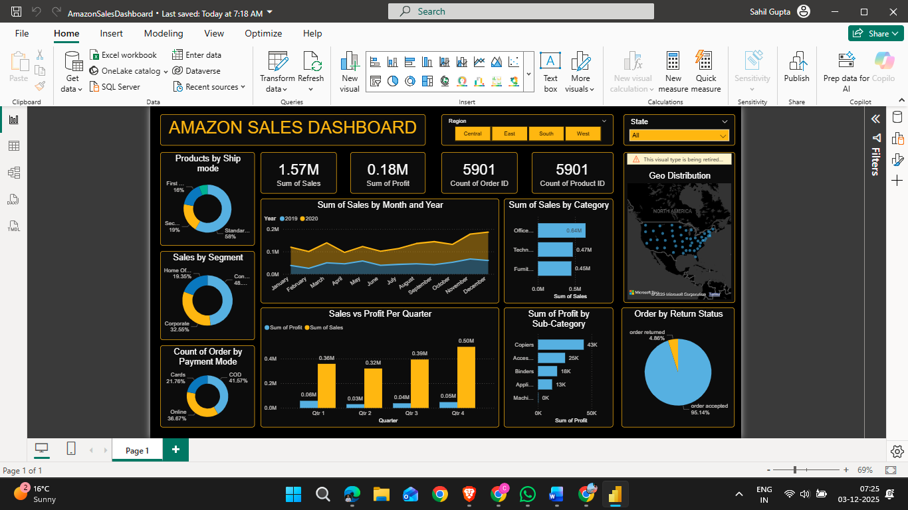

# Amazon Sales Dashboard | Power BI

This Power BI project analyzes Amazon’s e-commerce sales performance using publicly available data.  
It provides insights into total sales, profit margins, return status, and category-wise performance.

## 🔍 Features
- Data cleaning and transformation using **Power Query**
- Created custom DAX columns for **Return Status** (Order Accepted / Rejected)
- Interactive visuals for **sales trends, profit, and regional performance**
- KPI cards and slicers for dynamic analysis

## 🧰 Tools Used
- Power BI Desktop
- DAX
- Power Query
- Excel (for data preparation)

## 📈 Insights
- Identified top-performing product categories
- Analyzed sales by region and time
- Derived insights into return patterns and profitability

---

This Power BI project analyzes Amazon’s e-commerce sales performance using publicly available data.  
It provides insights into total sales, profit margins, return status, and category-wise performance.

⭐ *This project was created as part of my learning journey into Data Analytics and Power BI.*
